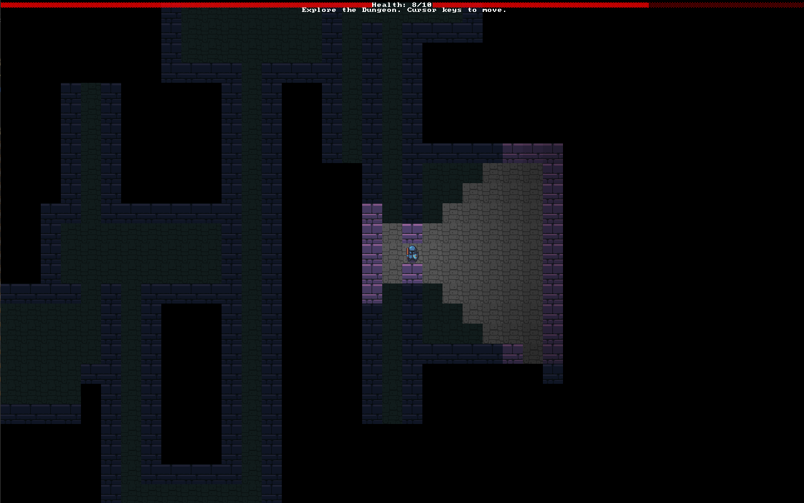
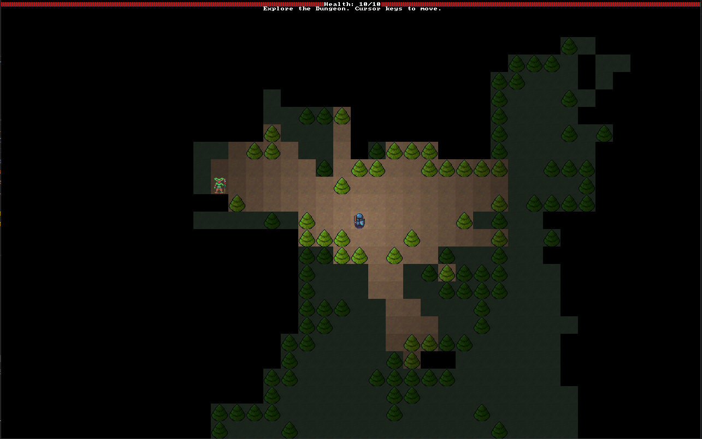

# Dungeon Crawler

"A dungeon crawler with procedurally generated levels, monsters of increasing difficulty,
and turn-based movement." - from [Hands-on Rust](https://pragprog.com/titles/hwrust/hands-on-rust/) book.

## Screenshots

